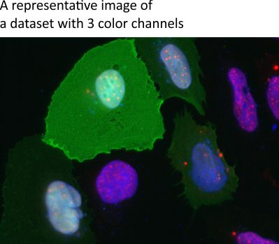
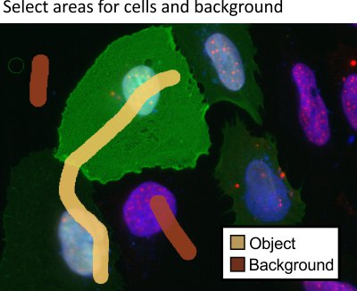
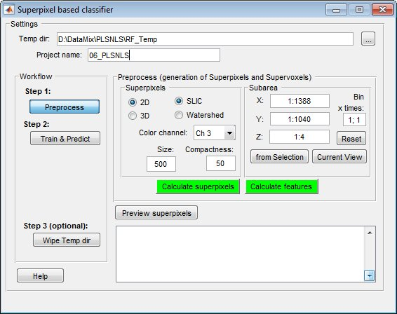
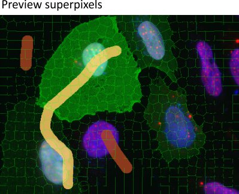
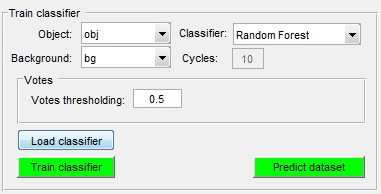
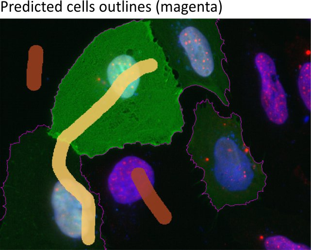

# Classifier of Superpixels/Supervoxels

*Back to [MIB](../../../index.md) | [User interface](../../index.md) | [Menu](../index.md) | [Tools](index.md)*

Tools for automatic image segmentation using a train-and-predict scheme based on superpixel/supervoxel classification.

---

## Overview

The **Classifier of superpixels/supervoxels** in Microscopy Image Browser is an effective method for automatic image segmentation, employing a train-and-predict approach. It utilizes the [SLIC (Simple Linear Iterative Clustering) algorithm](http://ivrl.epfl.ch/supplementary_material/RK_SLICSuperpixels/index.html) by Radhakrishna Achanta et al. from Ecole Polytechnique Federale de Lausanne (EPFL), Switzerland, to cluster pixels into superpixels (2D) or supervoxels (3D). These clusters are then characterized, and their features are used for classification, simplifying the segmentation process.

---

## Dataset and the aim of the segmentation

{align=left}

This example features a light microscopy dataset where the goal is to segment cell 
outlines (highlighted in green). 
Due to varying cell intensities, black-and-white 
thresholding is ineffective, making superpixel/supervoxel classification 
a suitable approach.

---

## Training the classifier

Training involves manually defining regions of interest (object and background) to build a classifier for predicting segmentation.

* Start a new model in the [Segmentation panel](../../panels/segm/index.md) by clicking Create
* Add two materials using + in the [Segmentation panel](../../panels/segm/index.md)
* Rename the materials:
   - Highlight the first material, right-click, and select *Rename* from the context menu to name it *Object*
   - Rename the second material to *Background* similarly

??? abstract "Snapshot"
    {.on-glb}

* Use the Brush tool to mark areas:
   - Select cell outlines and add them to the *Object* material (set *Add to* to `1` and press A)
   - Mark background areas and add them to the *Background* material (set *Add to* to `2` and press A)

??? abstract "Snapshot"
    {.on-glb}

* Launch the classifier via **Ribbon → Tools → Classifier → Superpixel classification**
* Specify a temporary directory (default: `RF_Temp` next to the dataset)

??? abstract "Snapshot"
    {.on-glb}

* Configure the classifier:
   - Select mode: 2D for 2D images and superpixels, or *3D* for 3D datasets and supervoxels
   - Choose superpixel type: SLIC for intensity-distinct objects, or *Watershed* for boundary-defined objects
   - Select Color channel for superpixel generation
   - Set Size and Compactness (for SLIC), or *Size* factor and *Black on white* (for Watershed: `0` for bright boundaries on dark background, >0 otherwise)
   - Optionally adjust the processing area using the *Subarea panel*
* Click Calculate superpixels to generate superpixels
* Click Preview superpixels to review them

??? abstract "Snapshot"
    {.on-glb}

* If superpixels are satisfactory, click Calculate features to extract features
* Click Train & Predict to access classification settings

??? abstract "Snapshot"
    {.on-glb}

* In the training window:
    - Load a previous classifier with Load classifier, or train a new one if labels exist
    - Set Object to *Object*
    - Set Background to *Background*
    - Choose a classifier type in Classifier
    - Click Train classifier to start training
    - Click Predict dataset to predict segmentation
* Check results in the [Image View panel](../../panels/imview/index.md). refine by adding more markers and repeating training and prediction

??? abstract "Snapshot"
    {.on-glb}

---

## Wiping the temp directory

The classifier generates temporary files in the `RF_Temp` directory during prediction. Remove them by clicking Wipe Temp dir or manually delete the folder using a file explorer.

!!! warning
    Ensure temporary files are no longer needed before wiping, as this action is irreversible

---

## References

- [SLIC (Simple Linear Iterative Clustering) algorithm](http://ivrl.epfl.ch/supplementary_material/RK_SLICSuperpixels/index.html) by Radhakrishna Achanta et al., Ecole Polytechnique Federale de Lausanne (EPFL), Switzerland

---

*Back to [MIB](../../../index.md) | [User interface](../../index.md) | [Menu](../index.md) | [Tools](index.md)*