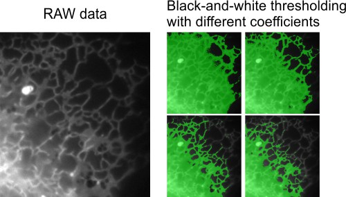
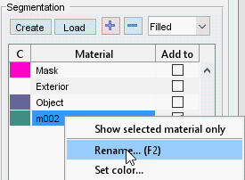
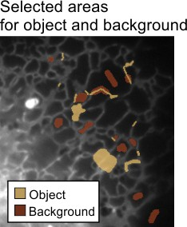
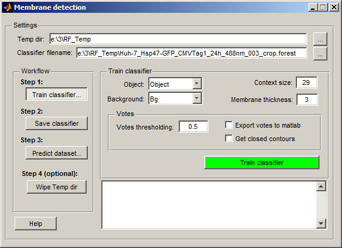
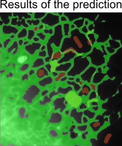
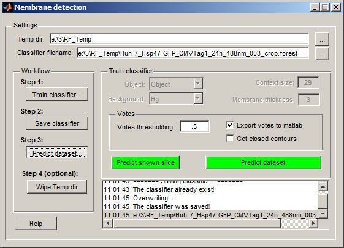

# Random Forest Classifier

Tools for automatic image segmentation using a train-and-predict scheme based on random forest classification.

---

## Overview

The **Random Forest Classifier** in Microscopy Image Browser (MIB) is a powerful method for automatic image segmentation, employing a train-and-predict approach. This implementation is based on [Random Forest for Membrane Detection](http://www.kaynig.de/demos.html) by Verena Kaynig and utilizes the [randomforest-matlab](https://code.google.com/p/randomforest-matlab/) library by Abhishek Jaiantilal. It excels in segmenting complex datasets where traditional methods like global thresholding fail due to varying background intensities.

---

## Dataset and segmentation goal

This example features a time-lapse dataset (movie) of endoplasmic reticulum captured using wide-field light microscopy. The goal is to segment the endoplasmic reticulum from the background in flat cellular regions. Global black-and-white thresholding is ineffective here due to intensity gradients across the background, making the random forest classifier a suitable alternative.

---

## Training the classifier

Training involves manually defining regions of interest (object and background) to build a classifier that can later predict segmentation across the dataset.

* Start a new model in the [Segmentation panel](../../panels/segm/index.md) by clicking Create
* Add two materials using + in the [Segmentation panel](../../panels/segm/index.md)
* Rename the materials:
      - Highlight the first material, right-click, and select *Rename* from the context menu to name it *Object*
      - Rename the second material to *Background* similarly

??? abstract "Snapshot"
    {.on-glb}

* Use the Brush tool to mark areas:
    - Select endoplasmic reticulum profiles and add them to the *Object* material (set *Add to* to `1` and press A)
    - Mark background areas and add them to the *Background* material (set *Add to* to `2` and press A)

??? abstract "Snapshot"
    {.on-glb}

* Launch the classifier via `Ribbon → Tools → Classifier → Membrane detection`

??? abstract "Snapshot"
    {.on-glb}

By default, the classifier creates a temporary directory (`RF_Temp`) next to the dataset location to store processed images and the classifier file. You can modify the temporary directory name and classifier filename in the Temp dir and Classifier filename fields.

* Configure the classifier:
    - Set Object to *Object*
    - Set Background to *Background*
    - Adjust Context size: smaller values suit short or highly curved membrane profiles
    - Set Membrane thickness: enter the approximate thickness of the membrane in pixels
    - Review the *Votes* section: adjust the threshold, enable export to MATLAB, or enforce closed membrane profiles

* Click Train Classifier to process the current slice and train the classifier based on segmented areas

??? abstract "Snapshot"
    {.on-glb}

* If the prediction isn’t satisfactory, segment additional areas (across multiple slices if needed) and retrain. Once satisfied, proceed to step 2 in the workflow and click Save classifier

---

## Prediction of the whole dataset

After training and saving the classifier, predict segmentation across the entire dataset.

* In the classifier window, go to step **Predict dataset...**

??? abstract "Snapshot"
    {.on-glb}

* Test the prediction on any slice by selecting it and clicking Predict. If results are acceptable, click Predict dataset to process the entire dataset

The prediction results are stored in the *Selection* layer. Transfer them to the *Model* or *Mask* layer for further refinement or saving to disk.

---

## Wiping the temp directory

The classifier generates large temporary files in the `RF_Temp` directory during prediction. Remove them by clicking Wipe Temp dir or manually delete the folder using a file explorer.

!!! warning
    Ensure you no longer need the temporary files before wiping the directory, as this action is irreversible

---

## References

- [Random Forest for Membrane Detection](http://www.kaynig.de/demos.html) by Verena Kaynig
- [randomforest-matlab](https://code.google.com/p/randomforest-matlab/) by Abhishek Jaiantilal

---

*Back to [MIB](../../../index.md) | [User interface](../../index.md) | [Menu](../index.md) | [Tools](index.md)*