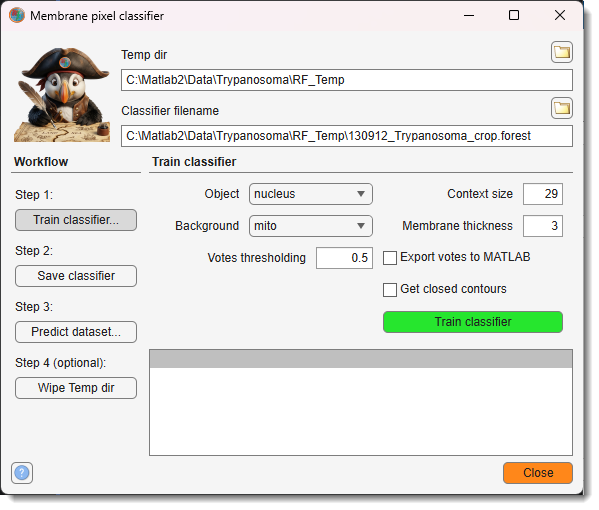
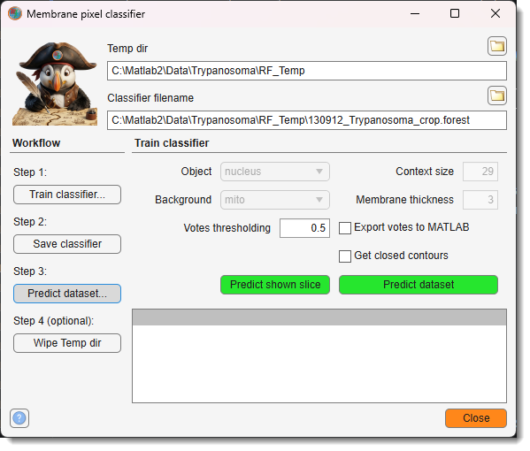

# Membrane Detector

Automatic image segmentation using a train-and-predict scheme based on random forest classification.

---

## Overview

The **Membrane Detector** is a pixel classifier for automatic image segmentation, based on
[Random Forest for Membrane Detection](http://www.kaynig.de/demos.html) by Verena Kaynig,
using the [randomforest-matlab](https://code.google.com/p/randomforest-matlab/) library by
Abhishek Jaiantilal.

It excels at segmenting complex datasets where global thresholding fails due to varying
background intensities or subtle intensity gradients.

Launch via `Ribbon → Tools → Classifiers → Membrane detector`.

---

## Interface

{.on-glb align=left width="300"}

The tool is divided into:

- **Top fields** — paths for the temp directory and classifier file
- **Workflow panel** — step-by-step guide to training and predicting
- **Train classifier panel** — training and prediction settings
- **Log list** — progress messages from the last operation

<div class="clear-float"></div>

---

## File paths

- <span class="widget widget-edit">Temp dir</span> — directory for temporary feature files (`.fm`) generated during training and prediction. Defaults to `RF_Temp/` next to the open dataset. Use the browse button to change it.
- <span class="widget widget-edit">Classifier filename</span> — full path to the `.forest` classifier file. Use the browse button to pick a location.

---

## Workflow panel

Guides the four-step process.

**Step 1** — <span class="widget widget-button">Train classifier...</span> (toggle): activates *Train* mode. Training controls in the *Train classifier panel* are enabled. The main action button reads `Train classifier`.

**Step 2** — <span class="widget widget-button">Save classifier</span>: saves the trained classifier to the file specified in <span class="widget widget-edit">Classifier filename</span>.

**Step 3** — <span class="widget widget-button">Predict dataset...</span> (toggle): activates *Predict* mode. Training-specific controls are disabled; <span class="widget widget-button">Predict shown slice</span> appears. The main action button reads `Predict dataset`.

**Step 4 (optional)** — <span class="widget widget-button">Wipe Temp dir</span>: deletes all files in <span class="widget widget-edit">Temp dir</span> to free disk space.

!!! warning
    Wiping the temp directory is irreversible. Make sure the temporary files are no longer needed before proceeding.

---

## Train classifier panel

Settings used for both training and prediction.

- <span class="widget widget-dropdown">Object</span> — model material that marks the object (e.g., membrane).
- <span class="widget widget-dropdown">Background</span> — model material that marks the background.
- <span class="widget widget-edit">Context size</span> — context window radius in pixels for feature extraction. Smaller values suit short or highly curved structures; larger values capture more context.
- <span class="widget widget-edit">Membrane thickness</span> — expected thickness of the target structure in pixels.
- <span class="widget widget-edit">Votes thresholding</span> — threshold applied to the classifier vote probability (0–1) to produce a binary result. Values closer to 1 require stronger classifier confidence.
- <label class="widget widget-checkbox">Export votes to MATLAB</label> — exports the raw per-pixel vote probability map to the MATLAB workspace as `mibVotes` after each training or prediction step.
- <label class="widget widget-checkbox">Get closed contours</label> — applies skeletonise + dilate morphological closing to the prediction, useful for enforcing closed membrane outlines.
- <span class="widget widget-button">Predict shown slice</span> *(predict mode only)* — runs prediction on the currently displayed slice as a quick preview. Results appear in the *Selection* layer.
- <span class="widget widget-button">Train classifier</span> / <span class="widget widget-button">Predict dataset</span> — the main action button. Its label changes with the active mode:
    - *Train mode*: trains the classifier on the current slice using the labeled materials.
    - *Predict mode*: runs prediction across the entire dataset (or the subrange shown in the log).

---

## Step-by-step example

This example segments endoplasmic reticulum from a time-lapse widefield dataset where
global thresholding is ineffective due to background intensity gradients.


### 1 — Label training areas

- Start a new model in the [Segmentation panel](../../panels/segm/index.md) with <span class="widget widget-button">Create</span>
- Add two materials with <span class="widget widget-button">+</span> and rename them *Object* and *Background*

??? abstract "Snapshot"
    {.on-glb}

- Use the Brush tool to mark regions:
    - Select endoplasmic reticulum profiles → press <span class="widget widget-button">A</span> to add to *Object*
    - Mark background areas → press <span class="widget widget-button">A</span> to add to *Background*

??? abstract "Snapshot"
    {.on-glb}

### 2 — Train the classifier

- Launch via `Ribbon → Tools → Classifiers → Membrane detector`
- Set <span class="widget widget-dropdown">Object</span> to *Object* and <span class="widget widget-dropdown">Background</span> to *Background*
- Adjust <span class="widget widget-edit">Context size</span> and <span class="widget widget-edit">Membrane thickness</span> as needed
- In Step 1, click <span class="widget widget-button">Train classifier...</span> to activate train mode
- Click <span class="widget widget-button">Train classifier</span> to train on the current slice

??? abstract "Snapshot"
    {.on-glb}

- If the result is unsatisfactory, add more labels (across multiple slices if needed) and retrain
- Once satisfied, click <span class="widget widget-button">Save classifier</span> (Step 2)

### 3 — Predict the whole dataset

- In Step 3, click <span class="widget widget-button">Predict dataset...</span> to activate predict mode
- Use <span class="widget widget-button">Predict shown slice</span> to preview the result on the current slice

??? abstract "Snapshot"
    {.on-glb}

- If acceptable, click <span class="widget widget-button">Predict dataset</span> to process the full dataset

Prediction results are written to the *Selection* layer. Transfer them to the *Mask* or *Model* layer for further refinement or saving.

### 4 — Clean up

- Click <span class="widget widget-button">Wipe Temp dir</span> (Step 4, optional) to remove the large feature files generated during prediction.

---

## Batch scripting

This tool supports batch scripting for automation.

??? abstract "Example"

    ```matlab
    % Train on the current slice
    BatchOpt.Mode                 = {'trainClassifier', {'trainClassifier','predictDataset'}};
    BatchOpt.ObjectMaterial       = {'Object'};
    BatchOpt.BackgroundMaterial   = {'Background'};
    BatchOpt.ContextSize          = {29, [1 Inf], true};
    BatchOpt.MembraneThickness    = {3, [1 Inf], true};
    BatchOpt.VotesThreshold       = {0.5, [0 1], false};
    BatchOpt.ExportVotes          = false;
    BatchOpt.SkelClosed           = false;

    obj.mibController.startController('controllers.MembranePixClassifier', [], BatchOpt);

    % Predict the full dataset
    BatchOpt.Mode{1} = 'predictDataset';
    obj.mibController.startController('controllers.MembranePixClassifier', [], BatchOpt);
    ```

---

## References

- [Random Forest for Membrane Detection](http://www.kaynig.de/demos.html) by Verena Kaynig
- [randomforest-matlab](https://code.google.com/p/randomforest-matlab/) by Abhishek Jaiantilal

---

*Back to [MIB](../../../index.md) | [User interface](../../index.md) | [Ribbon](../index.md) | [Tools](index.md)*
