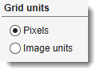
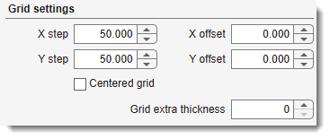
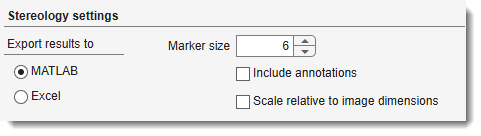

# Stereology

Counts model material occurrences at grid intersection points to calculate surface-area fractions. Results can be exported to MATLAB or Excel.

[:fontawesome-brands-youtube:{.red-color} Demonstration](https://youtu.be/5gOiyVNr2vY)

---

## Overview

{.on-glb align=left width="380"}

The **Stereology** tool overlays a regular grid on the image, identifies grid intersection points,
and counts how many intersections fall on each model material. From these counts it calculates
**surface fractions** and **surface area estimates** per material.

Launch via `Ribbon → Tools → Stereology`.

**Workflow:**

1. Segment objects of interest into a *Model* layer
2. Generate a grid (stored in the *Mask* layer) with 1. Generate grid
3. Run the analysis with 2. Do stereology

???+ example "Application of stereology to quantify surface fractions"
    {.on-glb align=left}

---

## Grid units panel

{align=left}
Selects the unit system for all grid size and offset values.

- Pixels — all grid values are in pixels (default)
- Image units — all grid values are in the physical units defined in [Dataset → Parameters](../dataset/index.md#voxels) (e.g., µm)

---

## Grid settings panel

{align=left}

Defines the geometry of the grid.
- X step — horizontal distance between grid lines (default 50 pixels).
- Y step — vertical distance between grid lines (default 50 pixels).

- <label class="widget widget-checkbox">Centered grid</label> — when checked, the grid is
  centred in the image (equal margins on all sides); when unchecked, the grid starts at the
  *X offset* / *Y offset* position.
- X offset — horizontal offset of the first grid line from the image edge (non-centred mode only).
- Y offset — vertical offset of the first grid line from the image edge (non-centred mode only).
- Grid extra thickness — additional dilation (in pixels) applied to each grid line via a cross-shaped structuring element. Use `0` for a single-pixel grid.

!!! warning
    When *Grid extra thickness* is `0`, the grid is only visible at ≥ 100% magnification. Increase it to see the grid at lower zoom levels.

1. Generate grid — creates the grid and writes it to the **Mask** layer. If a mask already exists, you are asked to confirm before overwriting. The grid can be undone with ++ctrl+z++.

!!! info
    The mask layer display style (contours vs. solid) can be changed at
    `Ribbon → Home → Preferences → Colors and styles → Masks → show as contours`.

---

## Stereology settings panel

{.on-glb align=left width="380"}

Controls how the analysis is performed and where results are exported.

**Export results to** (radio buttons):

- MATLAB — after analysis, prompts for a workspace variable name and assigns the results structure to it (default).
- Excel — saves results to a `.xls` file; prompts for a save path.

**Options**:

- Marker size — radius (in pixels) of the filled circle stamped on each grid intersection in the result model layer (default 6).
- <label class="widget widget-checkbox">Include annotations</label> — also counts annotation labels from the [Segmentation Panel → Annotations](../../panels/segm/segm-annotations.md) at each grid intersection. The counts are added to the exported structure under `results.Annotations`.
- <label class="widget widget-checkbox">Scale relative to image dimensions</label> — when checked, intersection counts for boundary grid cells (cells partially outside the image) are scaled by the fraction of the cell area that lies inside the image. This corrects surface fraction estimates for grids that don't divide the image evenly.

2. Do stereology — runs the analysis. Requires:

- A **Mask** layer containing a grid (created by 1. Generate grid)
- A **Model** layer with labeled materials

Results are written back to the Model layer (intersection dots per material) and exported to MATLAB or Excel.

---

## Exported results structure

The MATLAB results structure contains: 

| Field | Description |
|-------|-------------|
| `Occurrence` | `[time × depth × materials]` array of raw intersection counts |
| `SurfaceFraction` | `[time × depth × materials]` fraction of intersections per material |
| `Surface_in_units` | `[time × depth × materials]` surface area estimate in physical units² |
| `GridSize` | Grid step in pixels (`pixelsX`, `pixelsY`) and units (`unitsX`, `unitsY`, `unitsType`) |
| `Materials` | Cell array of material names |
| `Filename` | Path to the source image |
| `ModelName` | Path to the model file |
| `CenteredGrid` | `true` if the centred-grid option was used |
| `ScaleToImage` | `true` if boundary scaling was applied |
| `Annotations` | *(optional)* annotation label counts; present when *Include annotations* is checked |

---

*Back to [MIB](../../../index.md) | [User interface](../../index.md) | [Ribbon](../index.md) | [Tools](index.md)*
