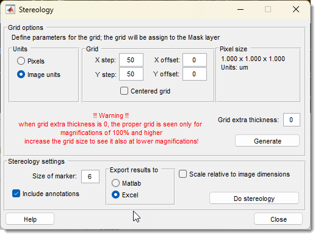
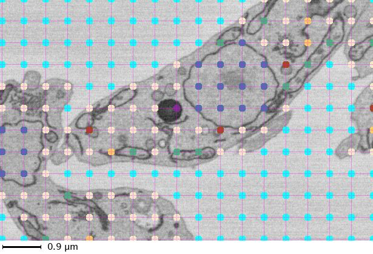

# Stereology

*Back to [MIB](../../../index.md) | [User interface](../../index.md) | [Ribbon](../index.md) | [Tools](index.md)*

Counts intersections between model materials and grid lines, with spacing definable in pixels or image units. Results can be exported to MATLAB or Excel.

[:fontawesome-brands-youtube:{.red-color} Demonstration](https://youtu.be/5gOiyVNr2vY)

## Details and parameters

{.on-glb align=left width="400"}

Generate the grid with the Generate button in the *Grid options panel*. 
Use the <label class="widget widget-checkbox">Centered grid</label> checkbox to generate the grid that is equally spaced from the image edges. 
Start analysis with the Do stereology button.  
The <label class="widget widget-checkbox">Include annotations</label> checkbox also calculates occurrences of 
annotation labels from the [Segmentation Panel → Annotations](../../panels/segm/segm-annotations.md).

!!! warning
    When grid thickness is 1 pixel (*grid extra thickness* = 0), the grid may not display properly below 100% magnification. Increase *extra grid thickness* to view at lower magnifications.

!!! info
    Style of the mask layer can be switched from contours to solid lines from  
    `Ribbon → Home →Preferences->Colors and styles->Masks->show as contours`

???+ example "Application of stereology to quantify surface fractions" 
    {.on-glb align=left}

---

*Back to [MIB](../../../index.md) | [User interface](../../index.md) | [Ribbon](../index.md) | [Tools](index.md)*
