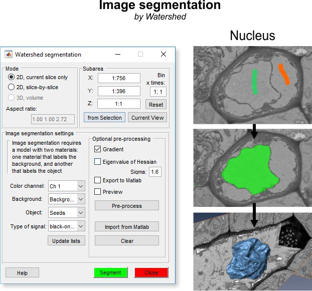
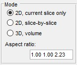
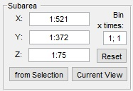
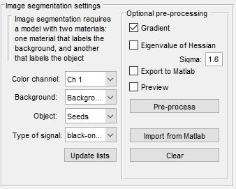
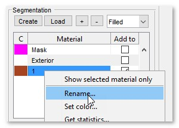
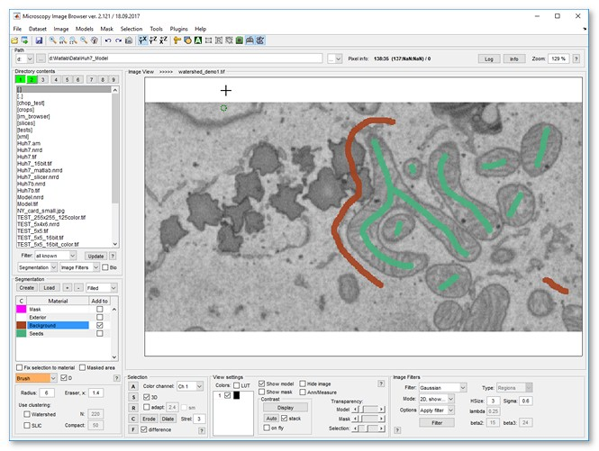
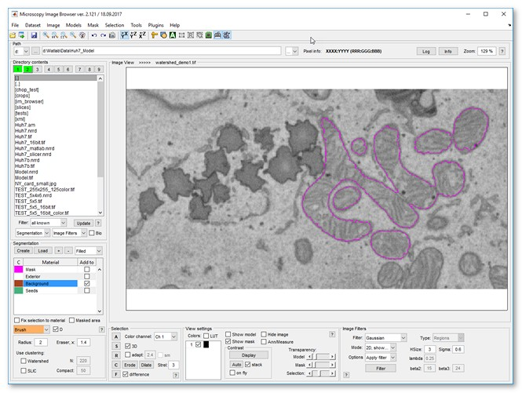
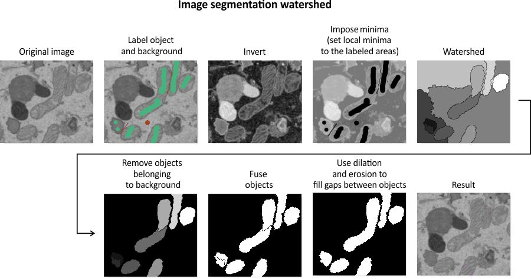

# Watershed Segmentation

Semi-automated image segmentation using the Watershed method in 
Microscopy Image Browser.

---

## Overview

{.on-glb}

The **Watershed segmentation** tool in MIB provides semi-automated 
segmentation using the Watershed method, ideal for separating objects 
with distinct boundaries, such as membrane-enclosed organelles. 

!!! note

    For better interactivity and performance consider using the [Graphcut segmentation tool](tools-graphcut.md) instead.

---

## Mode panel

The *Mode panel* lets you select the segmentation scope.

{align=left}

- <label class="widget widget-checkbox">2D, current slice only</label> segments only the current slice in the [Image View panel](../../panels/selection_imview/imview.md)
- <label class="widget widget-checkbox">2D, slice-by-slice</label> applies 2D segmentation to each slice individually
- <label class="widget widget-checkbox">3D, volume</label> performs 3D segmentation on the entire dataset or a subarea (see *Subarea panel* below)
- Aspect ratio for 3D... displays the dataset’s 
aspect ratio, derived from voxel sizes in ([Ribbon → Dataset → Parameters](../dataset/index.md#parameters)). this is used when Watershed relies on a distance map (see *Image segmentation settings* below)

---

## Subarea panel

The *Subarea panel* defines a dataset subset for processing, useful for large datasets or binning.

{align=left}

- X:... sets the width range (e.g., `1:512`)
- Y:... sets the height range
- Z:... sets the z-slice range
- from Selection fills *X*, *Y*, and *Z* with coordinates from the *Selection* layer’s bounding box
- Current View limits *X* and *Y* to the visible area in the [Image View panel](../../panels/selection_imview/imview.md)
- Reset restores full dataset dimensions
- Bin x times... applies a binning factor to reduce detail for faster processing

---

## Image segmentation settings

The *Watershed* workflow uses labeled areas (Background and Object) for segmentation, 
contrasting with the [Graphcut workflow](tools-graphcut.md). 
It’s less interactive, slower per execution, and best for objects with 
distinct boundaries. Graphcut, with its preprocessing focus, is faster for 
repeated interactions and handles both boundaries and intensity contrast, making 
it preferable for most cases.

{.on-glb align=left width="300"}

- Color channel selects the channel for segmentation
- Background selects the model material labeling background areas
- Object selects the model material labeling objects
- Type of signal chooses *black-on-white* (dark boundaries) or *white-on-black* (bright boundaries)
- Update lists refreshes material lists

 

Optional pre-processing (Watershed only):

  - <label class="widget widget-checkbox">Gradient</label> applies a gradient filter to enhance object borders
  - <label class="widget widget-checkbox">Eigenvalue of Hessian</label> preprocesses data for improved Watershed results; adjust with *Sigma* fields
  - <label class="widget widget-checkbox">Export to MATLAB</label> sends preprocessed data to the MATLAB workspace
  - <label class="widget widget-checkbox">Preview</label> displays preprocessing results in the [Image View panel](../../panels/selection_imview/imview.md)
  - Pre-process starts preprocessing (turns green when data is ready)
  - Import from MATLAB loads a dataset from the MATLAB workspace for segmentation
  - Clear removes preprocessed data from memory

---

## Image segmentation example

Follow these steps to segment mitochondria using Watershed:

* Load a sample dataset: `Ribbon → Home → Import image from → URL`, enter 
*http://mib.helsinki.fi/tutorials/WatershedDemo/watershed_demo1.tif*
* Add a material named *Background* in the [Segmentation panel](../../panels/segm/index.md) with + (right-click to rename)
* Use the Brush tool to label cytoplasm, then press A to add it to *Background*

??? abstract "Snapshot"
    {.on-glb}

* Add another material named *Seeds* with +
* Label mitochondria interiors, then press A to add to *Seeds*

??? abstract "Snapshot"
    {.on-glb}

* Start Watershed via `Ribbon → Tools → Semi-automatic segmentation → Watershed`
* Ensure *Background* and *Seeds* are set in *Image segmentation settings*
* Click Segment to segment mitochondria
* Add more seeds to refine, then re-segment with Segment
* Results appear in the *Mask* layer
* Optionally smooth the mask: [Ribbon → Mask → Smooth Mask](../mask/index.md#smooth-mask)

??? abstract "Snapshot"
    {.on-glb}

---

## Algorithm for image segmentation with watershed

{.on-glb}

The diagram illustrates the step-by-step process of the Watershed segmentation algorithm, transforming labeled input into segmented objects.

---

## References

- [Watershed transform question from tech support](http://blogs.mathworks.com/steve/2013/11/19/watershed-transform-question-from-tech-support/) by Steve Eddins
- [Cell segmentation](http://blogs.mathworks.com/steve/2006/06/02/cell-segmentation/) by Steve Eddins

---

*Back to [MIB](../../../index.md) | [User interface](../../index.md) | [Menu](../index.md) | [Tools](index.md)*