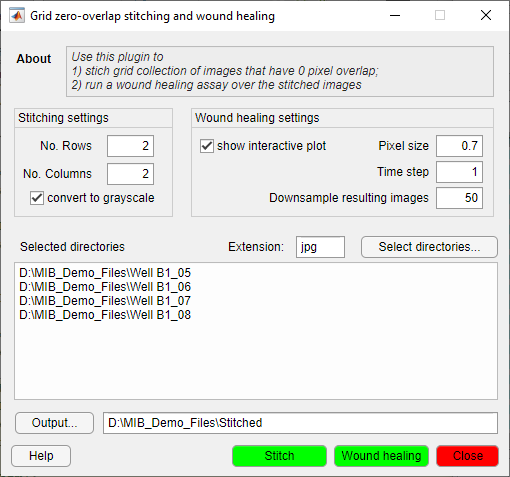

# Wound Healing Assay

*Back to [MIB](../../../index.md) | [User interface](../../index.md) | [Menu](../index.md) | [Tools](index.md)*

The wound healing assay is a microscopy-based technique used to study cell migration. 
A "wound" or gap is created in a cell monolayer, and the movement of cells into this gap 
is monitored over time using time-lapse imaging to assess healing dynamics.

{.on-glb align=left width="400"}

Measures cell migration parameters, tested on the Imagen Cell-IQ platform with 0-pixel overlap image grids.  
The tool has two parts: grid stitching of time-lapse datasets and the wound healing analysis

[:fontawesome-brands-youtube:{.red-color} Demonstration](https://youtu.be/D9hvyXMyNfU)

## Stitching  
- Use the *Stitching settings panel* to specify grid cell count (each cell in its own directory, named sequentially from top-left to bottom-right horizontally).
- Set filename extension.
- Select directories with grid images (Select directories...).
- Specify output directory (Output...).
- Start with the Stitch button.

## Wound healing analysis 
 
- Configure the *Wound healing settings panel*: pixel size, time step, and optional downsampling. Check <label class="widget widget-checkbox">show interactive graph</label> for an interactive plot after each time point.
- Select directories with stitched images (Select directories...).
- Start with the Wound healing button.

Results:
  

  - Plot of minimal, average, and maximal wound width.
  - Excel sheet and MATLAB file with wound width values.
  - Directory with wound snapshots.
  - Text file with timestamps from original images.

!!! abstract "Reference"  
  
    Based on [Cell Migration in Scratch Wound Assays](https://se.mathworks.com/matlabcentral/fileexchange/67932-cell-migration-in-scratch-wound-assays) by Constantino Carlos Reyes-Aldasoro.  
     **Cite as**: CC Reyes-Aldasoro, D Biram, GM Tozer, C Kanthou, *Electronics Letters* 44 (13), 791-793.
     Code available on [GitHub](https://www.github.com/reyesaldasoro/Cell-Migration).

---

*Back to [MIB](../../../index.md) | [User interface](../../index.md) | [Menu](../index.md) | [Tools](index.md)*