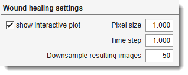

# Wound Healing Assay

Measures cell migration in scratch wound assays from time-lapse microscopy.
Includes grid stitching for tiled image collections.

## Overview

{.on-glb align=left width="400"}

The **Wound Healing Assay** tool monitors cell migration into a scratch wound over time.

[:fontawesome-brands-youtube:{.red-color} Demonstration](https://youtu.be/D9hvyXMyNfU)

<div class="clear-float"></div>

It operates in two independent steps:

1. **Stitch** — assemble a tiled (grid) image collection into a single stitched image per time point
2. **Wound healing** — detect wound width in each image and export results as plots, Excel, and MATLAB files

Launch via `Ribbon → Tools → Wound Healing Assay`.

---

## Stitching settings panel

Assembles a grid of overlapping-free tile images (e.g. from Imagen Cell-IQ) into one image per time point.

- <span class="widget widget-edit">No. Rows</span> — number of tile rows in the grid (default: 3)
- <span class="widget widget-edit">No. Columns</span> — number of tile columns in the grid (default: 3)
- <label class="widget widget-checkbox">convert to grayscale</label> — average RGB channels to produce a single-channel stitched image
- <span class="widget widget-edit">Extension:</span> — filename extension for input images (default: `tif`)

**Directory selection:**

- <span class="widget widget-button">Select directories...</span> — select input directories, one per tile, ordered left-to-right then top-to-bottom (i.e., row-major). The number of directories must equal *No. Rows × No. Columns*.
- <span class="widget widget-edit">output directory</span> / <span class="widget widget-button">Output...</span> — type or browse to the output directory where stitched images will be saved.

<span class="widget widget-button">Stitch</span> — starts stitching. Each time point is saved as `<original-name>_stitched.<ext>`. A text file with file modification timestamps is also written to the output directory.

!!! tip
    When the extension is `jpg`, a quality prompt (0–100) appears before stitching begins.

---

## Wound healing settings panel

{.on-glb align=left width="400"}

Measures wound width at each time point using the `cellMigration` algorithm.

<div class="clear-float"></div>

- <span class="widget widget-edit">Pixel size</span> — physical pixel size in µm (default: 1). Used to convert wound widths from pixels to µm.
- <span class="widget widget-edit">Time step</span> — time interval in hours between consecutive images (default: 1). Used to label the time axis in result plots.
- <span class="widget widget-edit">Downsample resulting images</span> — resizes annotated wound snapshot images to this percentage of their original size before saving (default: 50 %). Reduces disk usage for result snapshots.
- <label class="widget widget-checkbox">show interactive plot</label> — display a live plot of wound width (min / average / max) after each time point is processed.

**Directory selection:**

- <span class="widget widget-button">Select directories...</span> — select one or more directories of stitched images to analyse. Each directory is processed independently.

<span class="widget widget-button">Wound healing</span> — runs the analysis. For each directory:

1. Detects wound boundaries per image using `cellMigration.m`
2. Plots minimum, average, and maximum wound width vs. time
3. Saves annotated images to a `snapshots/` subfolder inside the input directory
4. Exports results to `WoundAssayResults_<dirname>.mat` and `WoundAssayResults_<dirname>.xlsx`

!!! warning
    `cellMigration.m` must be on the MATLAB path. It is distributed with the MIB plugin under `Plugins/WoundHealingAssay/`.

---

## Exported results

| Output | Location | Content |
|--------|----------|---------|
| `.mat` file | input directory | `results.minVec`, `results.maxVec`, `results.avVec` — wound width (µm) per time point |
| `.xlsx` file | input directory | Same data as a spreadsheet with image names, time points, and pixel/time step metadata |
| Snapshots | `snapshots/` inside input dir | Annotated wound images (`Wound_<original-name>`) |
| Timestamps | output directory | `<name>_TimeStamps.txt` — file modification dates for each stitched time point |

---

## Batch scripting

Batch mode runs the *Stitch* step only (wound healing requires interactive `cellMigration` output).

??? abstract "Example"

    ```matlab
    BatchOpt.Extension           = 'tif';
    BatchOpt.NoRows              = {3, [1 Inf], 'on'};
    BatchOpt.NoColumns           = {3, [1 Inf], 'on'};
    BatchOpt.SelectedDirectories = {'C:\data\pos1', 'C:\data\pos2', ...};
    BatchOpt.OutputDirectory     = 'C:\data\stitched';
    BatchOpt.ConvertToGrayscale  = true;

    obj.mibController.startController('controllers.WoundHealing', [], BatchOpt);
    ```

---

## References

Based on [Cell Migration in Scratch Wound Assays](https://se.mathworks.com/matlabcentral/fileexchange/67932-cell-migration-in-scratch-wound-assays) by Constantino Carlos Reyes-Aldasoro.

**Cite as**: CC Reyes-Aldasoro, D Biram, GM Tozer, C Kanthou, *Electronics Letters* 44(13), 791–793, 2008.
Code available on [GitHub](https://www.github.com/reyesaldasoro/Cell-Migration).

---

*Back to [MIB](../../../index.md) | [User interface](../../index.md) | [Ribbon](../index.md) | [Tools](index.md)*
